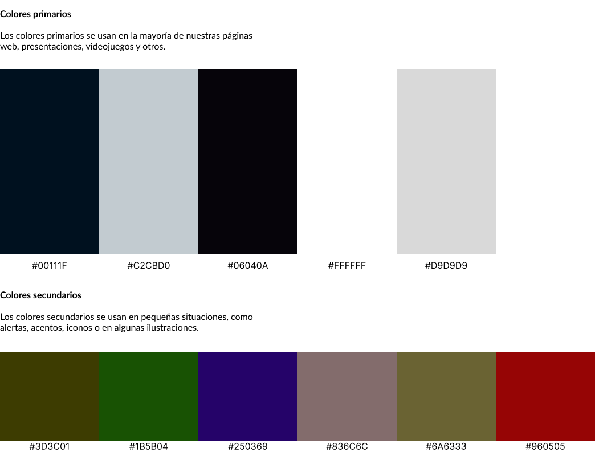
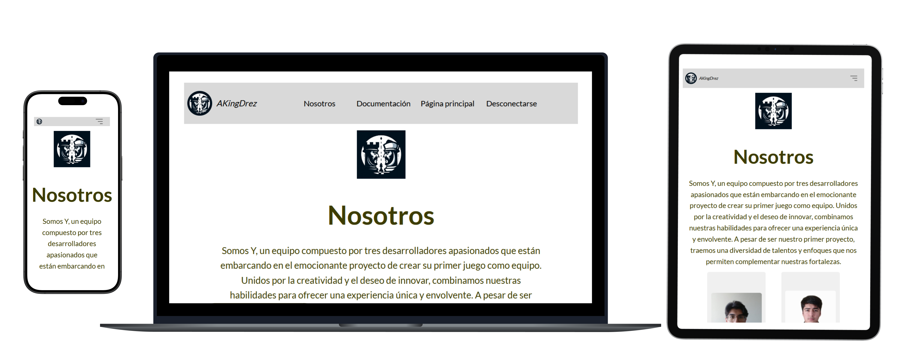
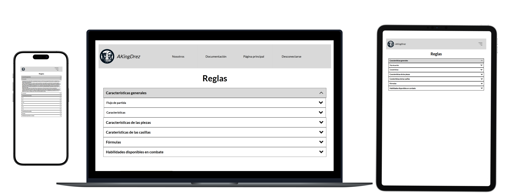
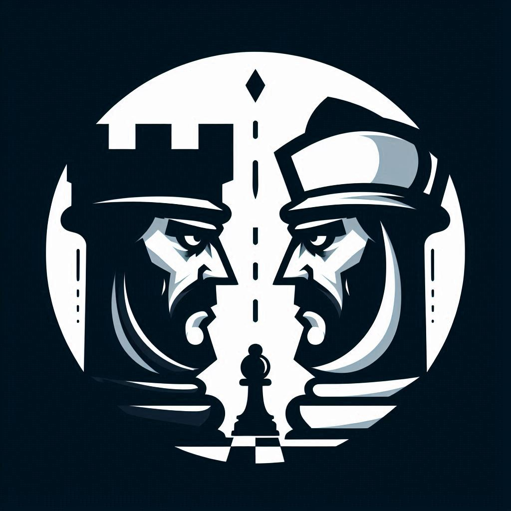

# Mejorar Proyecto Web

- **Nombre Grupo:** TeamPanasDev
- **Miembros:**
  - Eduardo Sepúlveda - esep@uc.cl
  - Kael Fernández - kael.fernndez@uc.cl
  - Jean Fuentes - jhfuentes@uc.cl (abandona)
  - Gonzalo Barrueto - gbarrueto@uc.cl
- **Link aplicación:** https://mejorarproyectoweb.netlify.app

## Administrador

- **Rutas administrador:**
  - **Login:** /akingdrez/administrator/login
  - **Panel:** /akingdrez/administrator

## Descripción general :thought_balloon:

- **¿De qué se tratará el proyecto?**
> Como equipo, se desarrollará un juego inspirado en el Ajedrez clásico, manteniendo algunas reglas base y añadiendo otras reglas nuevas junto con una jugabilidad diferente e innovadora.  
> ***AKingDrez: Strategy & Combat***, el nuevo juego inspirado en el Ajedrez podría describirse como una fusión estratégica entre el Ajedrez clásico y un sistema de combates por turnos que introduce una capa táctica y dinámica adicional e innovadora. Aunque las piezas conservan sus reglas base como el movimiento y rango de ataque en el tablero, las mecánicas cambian radicalmente a consecuencia de otras reglas incorporadas en el tablero que pueden afectar las características y cualidades de las piezas, más aún cuando una pieza ataca a otra.

- **¿De qué trata el juego?**
> El juego se desarrollará en un tablero de 8x8, con las piezas bases del Ajedrez clásico, con la diferencia de que las casillas afectarán en el desarrollo y el desempeño de una partida. Cada pieza tiene atributos únicos como puntos de vida  (HP), puntos de ataque (DMG) y puntos de defensa (DFS), lo que permite que los enfrentamientos y ataque entre piezas no se resuelvan instantáneamente.  
> Al estar en el rango de ataque al inicio del turno, el jugador que posee el turno puede decidir si iniciar el combate o no, en donde si decide iniciar el combate los jugadores entrarán en un sistema de combate por turnos, el cual, solo involucra una pieza contra contra. En este combate, la pieza atacante iniciará con ventaja sobre la pieza atacada, pero esto no significa que su victoria este asegurada, puesto que a diferencia de el Ajedrez clásico, los enfrentamientos no se resuelven instantáneamente, y aunque la pieza atacante tenga la ventaja, la otra pieza perfectamente puede poseer mejores atributos u otros factores decisivos que causen que esta salga victoriosa y elimine a la pieza atacante.  
> Ahondando más en el sistema de combate por turnos, este sistema involucra el combate entre unicamente dos piezas del tablero como se mencionó anteriormente, en donde estas piezas pueden ser de un mismo tipo o diferente, ya sea un peón, torre, alfíl, entre otras. En el combate las piezas pueden únicamente atacar, aumentar sus puntos de defensa, dismunuir los puntos de denfensa de la pieza enemiga y lanzar una habilidad única correspondiente al tipo de pieza, pero esta última solo puede ser lanzada una vez por pieza durante toda la sesión.  
> Además, en relación al tablero, este contiene diferentes tipos de casillas. Estas casillas atribuyen ciertas características a la primera pieza que se pare sobre ella.  
> Finalmente, es importante mencionar el como finalizará una partida. Una partida se dará por finalizada cuando la pieza Rey de alguno de los dos jugadores sea eliminada, es decir, a diferencia de el Ajedrez clásico en donde basta con realizar un jaque mate para terminar el juego, en AkingDrez la pieza Rey se comporta igual que todas las demás, lo que quiere decir, que para eliminarla se debe iniciar un combate contra esta y ganarle. Cabe recalcar, que para iniciar un combate basta con que una pieza se encuentre en el rango de ataque de otra al inicio de un turno. Además, cuando se ingrese a un combate este únicamente finalizará cuando una pieza pierda todos sus puntos de vida, o con la única excepción de que una pieza en el combate sea un peón y utilice su habilidad única para escapar del combate.

- **¿Qué características tiene el juego?**  
> El **rango de movimiento**, **rango de ataque** y la **regla de transformación de los peones al llegar a la casilla inicial del oponente**, se mantienen sin cambios con respecto al Ajedrez casual, por lo que no se indagará sobre ello en las características siguientes.  
> Además, en el juego existe la mecánica para acertar golpes críticos y fallar ataques. Estos golpes críticos equivalen a un aumento del 70% de los puntos de ataque actual de la pieza, y la probabilidad de fallar ataques equivale a un 30%.

1. **Carácterísticas y atributos de las piezas:**  

> - **Peón:** Es la pieza más débil del juego, pero también a la que más provecho se le puede sacar.
>   - **Puntos de vida:** 15
>   - **Puntos de defensa:** 5
>   - **Puntos de ataque:** 5
>   - **Habilidad única:** *Escape furtivo.*
>     -  **Descripción:** El peón escapa del combate, moviéndose a la siguiente casilla disponible dentro del perímetro en 1 unidad. Prioriza las casillas en dirección al campo enemigo. Si una casilla está ocupada, busca en la siguiente disponible. Si las 8 casillas alrededor están ocupadas, el peón no puede activar la habilidad.

> - **Alfíl:** Es la pieza con más daño del juego, pero no cuenta con mucha puntos de vida y puntos de defensa.
>   - **Puntos de vida:** 30
>   - **Puntos de defensa:** 5
>   - **Puntos de ataque:** 40
>   - **Habilidad única:** *Filo imparable.*
>     -  **Descripción:** El alfíl con su gran velocidad y destreza ataca con su lanza a la pieza oponente directo en un punto vital, acertándole un golpe crítico potenciado equivalente a un aumento del 100% de sus puntos de ataque actuales.

> - **Caballo:** Es la pieza más ágil del juego, además de contar con un gran daño y movilidad.
>   - **Puntos de vida:** 50
>   - **Puntos de defensa:** 30
>   - **Puntos de ataque:** 25
>   - **Habilidad única:** *Carga con alabarda.*
>     -  **Descripción:** El jinete carga con su alabarda y con una gran embestida ataca a la pieza oponente, ignorando el 50% de su defensa en el **turno actual**. Además reduce en un 30% su defensa de **forma permanente** durante el resto del juego.

> - **Rey:** Es la pieza más importante del juego, siendo el estratega y líder de todas las piezas. Cuenta con estadísticas balanceadas y apoyo moral para sus aliados.
>   - **Puntos de vida:** 70
>   - **Puntos de defensa:** 50
>   - **Puntos de ataque:** 30
>   - **Habilidad única:** *Grito de batalla.*
>     - **Descripción:** El rey realiza un grito alentador de batalla, el cual otorga un aumento en las estadísticas de las piezas que se encuentren alrededor de este en el perímetro de 1 casilla. Se aumenta los puntos de vida, puntos de defensa y puntos ataque en un 30% de las **estadísticas base** de la pieza aliada durante el resto del juego.

> - **Reina:** Es la pieza protectora del rey, y al igual que el mítico ajedrez, impone con solo mirarla.
>   - **Puntos de vida:** 80
>   - **Puntos de defensa:** 40
>   - **Puntos de ataque:** 35
>   - **Habilidad única:** *Dominancia bruta*
>     - **Descripción:** La reina se aprovecha del momento de vulnerabilidad de la pieza oponente, que es cuando este tiene menos puntos de vida, y lo amenaza por convertirlo en su aliado. Este tiene una probabilidd de **((Puntos de vida máximos del enemigo - Puntos de vida actual del enemigo) / Puntos de vida máximos del enemigo) * 100** de ser dominado.

> - **Torre:** Es la pieza con mayor puntos de vida y puntos de defensa del juego, ninguna pieza puede traspasar sus grandes muros e imponente defensa.
>   - **Puntos de vida:** 100
>   - **Puntos de defensa:** 80
>   - **Puntos de ataque:** 5
>   - **Habilidad única:** *Torre de Babel*
>     - **Descripción:** Los puntos de vida y puntos de defensa de la torre aumentan en un 70% de sus estadísticas base durante 3 turnos del combate actual. Además, se aumenta los puntos de defensa de las piezas que se encuentren alrededor de esta en el perímetro de 1 casilla en un 30% de la defensa base de la pieza aliada durante los siguientes 3 turnos del jugador de la partida actual.

2. **Carácterísticas y atributos de las casillas:**  
> Las casillas en **AKingDrez** a diferencia de el Ajedrez clásico pueden tener diferentes carácterísticas y cualidades, pudiendo estas aumentar los puntos de vida, puntos de defensa y puntos de daño de una pieza, pero nunca disminuir algun atributo.  
> Estas casillas aparecerán en las coordenadas correspondientes solo si no existe ninguna pieza antes en esta.  
> Para describir este tipo de casillas únicas usaremos un **sistema de coordenadas alfanuméricas**, identificando primero una letra (columna) y un número (fila):
> - Columnas (verticales): Se identifican con letras, desde la **a hasta la h**.  
> - Fila (horizontales): Se identifican con números, desde el **1 al 8**.

> - **Casillas de vida:** La pieza que se encuentra en la casilla recupera puntos de vida equivalente al 20% de su vida base, si ya tiene sus puntos de vida máximos, esta casilla no causa efecto.  
Esta casilla luego de ser utilizada por la pieza se consume y se convierte en una casilla común.
>   - **Aparicion:** Estas casillas aparecerán en los turnos múltiples de 8, es decir, el turno 8, turno 16, etc.
>   - **Coordenadas:** (d4, e5)

> - **Casillas de defensa:** La pieza que se encuentra en la casilla aumenta un 20% sus puntos de defensa base.  
Esta casilla luego de ser utilizada por la pieza se consume y se convierte en una casilla común.
>   - **Aparicion:** Estas casillas aparecerán en los turnos múltiples de 8, es decir, el turno 8, turno 16, etc.
>   - **Coordenadas:** (d5, e4)

> - **Casillas de ataque:** La pieza que se encuentra en la casilla aumenta un 20% sus puntos de ataque base.  
Esta casilla luego de ser utilizada por la pieza se consume y se convierte en una casilla común.
>   - **Aparicion:** Estas casillas aparecerán en los turnos múltiples de 8, es decir, el turno 8, turno 16, etc.
>   - **Coordenadas:** (b4, g5)

3. **Fórmulas utilizadas en el juego:**

> - **Fórmula de consumo de vida:**  
>   - Daño recibido = Daño del atacante * (1 - (Puntos de defensa del defensor / (Puntos de defensa del defensor + 100)))

> - **Fórmula de dominación del enemigo (habilidad única de la reina):**  
>   - Probabilidad de dominación (%) = ((Vida máxima del enemigo - Vida actual del enemigo) / Vida máxima del enemigo) * 100

4. **Habilidades disponibles en el combate:**

> - **Ataque básico:** *(Puntos de ataque pieza)*
> - **Resiliencia:** Aumenta un **15%** la defensa actual de la pieza durante 2 turnos del combate actual. Solo se puede utilizar una vez por combate.
> - **Quebranta hombres:** Disminuye un **15%** la defensa actual de la pieza oponente durante 2 turnos del combate actual. Solo se puede utilizar una vez por combate.
> - **Habilidad única:** *(Habilidad única de la pieza)*

- **¿Cuál es el fin o la utilidad del proyecto?**
> Como equipo, al proyecto le vemos un gran potencial en varios aspectos, tanto desde un punto de vista enfocado en la innovación en los juegos de mesa como en su aplicación tecnológica.  A continuación, se desglozarán algunos fines y/o utilidades:  
> - **Innovación en juegos de mesa clásicos:**   
> AKingDrez ofrece una nueva versión del Ajedrez, añadiendo elementos como el combate por turnos, habilidades especiales y nuevas mecánicas en las casillas del tablero, lo que lo convierte en una experiencia fresca y única.  
> Este tipo de híbrido entre estrategia clásica y combates tácticos puede atraer tanto a jugadores tradicionales de ajedrez como a fanáticos de los juegos de estrategía, o incluso a nuevos jugadores que buscan probar algo nuevo.  
> Además, podría ser utilizado para introducir nuevas mecánicas en juegos clásicos de un estilo similar, permitiendo que antiguos jugadores redescubran el Ajedrez, mientras se atrae a nuevas generaciones.
> - **Aplicación tecnológica:**  
> Desde un punto de vista tecnológico, este proyecto puede ser un excelente caso de estudio para el desarrollo de inteligencia artifical aplicada a juegos de estrategia. Implementa un sistema de IA que no solo juegue Ajedrez, sino que también maneje los combates por tunos de manera eficiente, es un desafio interesante al que le vemos mucho margen como equipo y desarrolladores.
> - **Educación y aprendizaje:**  
> Al incorporar aspectos tácticos, los jugadores desarrollan habilidades de pensamiento estratégico y toma de desiciones en situaciones de combate. El juego exige que los jugadores analicen las estadísticas de cada pieza y decidan cuando es mejor atacar, defender o retirarse.
> - **Diversión y entretenimiento competitivo:**  
> Este proyecto puede expandirse hacia el juego competitivo, con el potencial de crear ligas o torneos en línea que combinen la lógica del Ajedrez con elementos de combate y habilidades especiales, lo cual es algo innovador.  
> Además, el componente de chat entre dos jugadores y el sistema de combate dinámico puede potenciar el juego social y la competición estratégica, fomentando la interacción entre jugadores.
> - **Desarrollo de equipo y profesional:**  
> Finalmente, como equipo de desarrolladores, este proyecto representa una oportunidad única para mejorar nuestras habilidades en desarrollo web, juegos interactivos, manejo de datos en tiempo real (estados de las piezas, casillas y del chat) y el diseño de sistemas complejos. También, podría ser útil a futuro como un portafolio para demostrar nuestras capacidades personales en diseño de videojuegos y aplicaciones dinámicas.

- **¿Quiénes son los usuarios objetivo de su aplicación?**
> La aplicación está dirigida a usuarios de todas las edades, ya sea jugadores del Ajedrez clásico, nuevos jugadores o incluso personas que se adentran en el mundo de los videojuegos.
> - **Jugadores de Ajedrez clásico:**  
>   - **Perfil:** Jugadores que ya están familiarizados con el Ajedrez y buscan una experiencia innovadora dentro de un juego que ya conocen.
>   - **Intereses:** Apreciarán la familiaridad del tablero y las piezas, pero se sentirán intrigados por las nuevas mecánicas de combate y habilidades especiales.
>   - **Motivación:** Buscan una variante fresca y emocionante del Ajedrez, además de desafiarse a sí mismos en un entorno que combina la estrategia de Ajedrez con un toque moderno, lo que podría revitalizar su interés por el juego.
> - **Jugadores de juegos por turnos:**   
>   - **Perfil:** Jugadores que disfrutan de juegos de estrategia como el mítico Pokemon por turnos, Fire Emblem, Final Fantasy Tactics o Fear and Hunger ***(no lo jueguen)***, y que valoran el control táctico y el "manejo de unidades" en escenarios de combate.
>   - **Intereses:** Les interesará la parte de los combates por turnos, así como la capacidad de tomar decisiones estratégicas en combate y gestionar habilidades especiales de las piezas.
>   - **Motivación:** Buscarán la emoción de enfrentarse a otros jugadores en un contexto de combates estratégicos con variables dinámicas.
> - **Jugadores de juegos de mesa modernos:**   
>   - **Perfil:** Personas que disfrutan de los juegos de mesa modernos y están interesados en mecánicas híbridas que combinan lo clásico con innovaciones.
>   - **Intereses:** Apreciarán la combinación del tablero clásico del ajedrez con un sistema de combate por tunos, ya que les recordará a muchos juegos de mesa contemporáneos que mezclan temas y mecánicas.
>   - **Motivación:** La mezcla de táctica y estrategia, junto con la variación de partidas, puede hacer que se enganchen al juego y busquen formar comunidades dentro de la app.
> - **Jugadores nuevos o sociales/casuales:**  
>   - **Perfil:** Jugadores que no están buscando una experiencia altamente competitiva o estratégica, sino más bien una forma de entretenimiento social que puedan disfrutar a su propio ritmo.
>   - **Intereses:** El componente de chat de la partida y las interacciones entre jugadores les permitirá disfrutar de un juego menos intenso, mientras se comunican con sus amigos o nuevos oponentes.
>   - **Motivación:** Estos jugadores buscan un juego fácil de entender, pero con suficiente profundidad para mantenerlo interesante en partidas ocasionales.

## Historia de Usuarios :busts_in_silhouette:

1. Yo como ***visitante***, *quiero* registrarme, *para* tener acceso al juego como jugador.
2. Yo como ***visitante***, *quiero* iniciar mi sesión, *para* comunicarme con mis amigos y jugar partidas.
3. Yo como ***visitante***, *quiero* revisar una descripción general del juego, *para* saber de qué trata.
4. Yo como ***visitante***, *quiero* revisar las reglas del juego, *para* saber cómo jugar.
5. Yo como ***visitante***, *quiero* revisar la información del equipo de desarrolladores, *para* saber quienes crearon el juego.
6. Yo como ***jugador***, *quiero* crear una sesión de juego, *para* esperar que algún jugador se una.
7. Yo como ***jugador***, *quiero* entrar a una sesión de juego, *para* desafiar a otro jugador conectado.
8. Yo como ***jugador***, *quiero* poder enviar un mensaje al otro jugador en una partida, *para* interactuar en tiempo real con el jugador.
9. Yo como ***jugador***, *quiero* añadir amigos, *para* tener contacto con nuevas personas.
10. Yo como ***jugador***, *quiero* enviar mensajes a mis amigos, *para* conversar con ellos.
11. Yo como ***jugador***, *quiero* escribir reseñas *para* dejar mi opinión sobre el juego, *para* que otros visitantes se hagan una idea del juego.
12. Yo como ***jugador***, *quiero* poder modificar mi perfil una vez registrado, *para* dejar mi información personalizada. 
13. Yo como ***administrador***, *quiero* poder eliminar a algun jugador, *para* eliminar cuentas de jugadores imprudentes.

## Diseño Web 💻
<!-- Insertamos la imagen colores.png -->

## Colores de alerta
<!-- Insertamos la imagen alertas.png -->

## Tipografía
<!-- Insertamos la imagen Tipografía.png -->

## Vistas principales

### LandingPage

<!-- Insertamos la imagen landing.png -->

.png)
.png)

### Nosotros

### Reglas

## Logo
<!-- Insertamos la imagen logo.png -->

